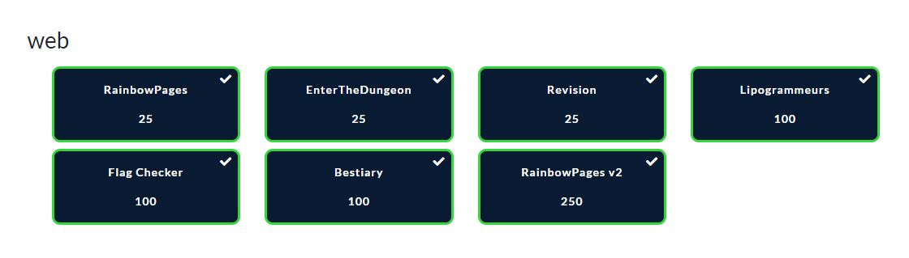

#  France CyberSecurity Challenge 2020

Voici les write-ups de quelques challenges que j’ai réalisés durant le FCSC 2020 organisé par l’ANSSI.

Je me suis concentré sur la partie WEB, que j’ai pu terminer entièrement durant ce CTF.

## [Web](./WEB)

* [RainbowPages - 25 pts](./WEB/RainbowPages.md)
* [EnterTheDungeon - 25 pts](./WEB/EnterTheDungeon.md)
* [Revision - 25 pts](./WEB/Revision.md)
* [Lipogrammeurs - 100 pts](./WEB/Lipogrammeurs.md)
* [Flag Checker - 100 pts](./WEB/FlagChecker.md)
* [Bestiary - 100 pts](./WEB/Bestiary.md)
* [RainbowPages v2 - 250 pts](./WEB/RainbowPages2.md)

