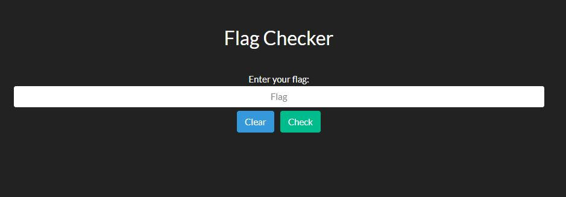
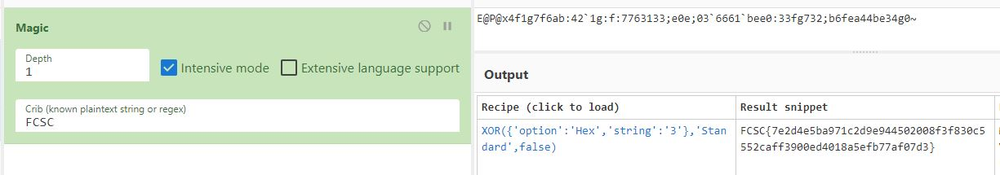

# Flag Checker - 100 pts


# Énoncé 
>Voici un service qui permet simplement de vérifier si le flag est correct.
>
>URL : http://challenges2.france-cybersecurity-challenge.fr:5005/
>
>Format du flag : FCSC{xxxx}
>

## Introduction

Ce challenge était le challenge web du FCSC le plus rapide à réaliser, ma solution s'effectue très rapidement depuis le simple navigateur à l'aide d'un outil.


## Résolution

Dans un premier temps, nous arrivons sur une page web nous permettant de rentrer un flag et de le vérifier



Bien évidemment, en essayant, on reçoit le message **Incorrect! Please check your flag again.**

Premier réflexe lors d'un challenge web, je regarde le code source de la page. Rien d'intéressant.

A l'aide de la console Sources (sur Google Chrome F12 > Sources) je vois qu'il y existe un **index.wasm**

En lisant ce fichier en diagonale, je trouve beaucoup d'instructions, mais également une chaîne qui me semble intéressante :

```
"E@P@x4f1g7f6ab:42`1g:f:7763133;e0e;03`6661`bee0:33fg732;b6fea44be34g0~"
```

En utilisant l'opération "magique" de CyberChef (https://gchq.github.io/CyberChef/) on trouve rapidement le FLAG. Il s'agissait d'une simple opération XOR, ce qui pouvait se deviner également après avoir réalisé quelques challenges de ce CTF, ou le XOR était omniprésent.



**FLAG :  _FCSC{7e2d4e5ba971c2d9e944502008f3f830c5552caff3900ed4018a5efb77af07d3}_**
