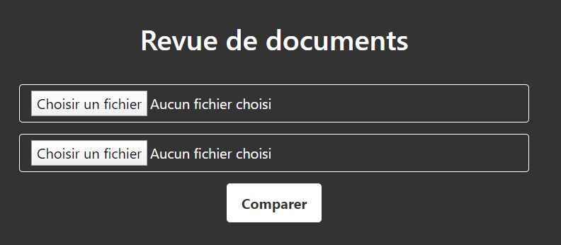

# Révision - 25 pts


# Énoncé 
>La société Semper est spécialisée en archivage de documents électroniques. Afin de simplifier le travail des archivistes, un outil simple de suivi de modification a été mis en ligne. Depuis quelques temps néanmoins, cet outil dysfonctionne. Les salariés se plaignent de ne pas recevoir tous les documents et il n'est pas rare que le système plante. Le développeur de l'application pense avoir identifié l'origine du problème. Aidez-le à reproduire le bug.	
>
>URL : http://challenges2.france-cybersecurity-challenge.fr:5003/
>
>Format du flag : FCSC{xxxx}
>

## Introduction

Ce challenge est un des challenges web du FCSC 2020, et repose sur les collisions SHA1.


## Résolution

Dans un premier temps, j'ai jeté un oeil à la page web, on ne remarque rien de particulier, on peut upload 2 PDF :



En ayant essayé, j'ai remarqué que si les 2 PDF envoyés sont les mêmes, ils nous le signalent, et il ne se passe rien. Si les 2 sont différents, le site nous dit qu'ils sont transmis pour une analyse approfondie.

Un autre élément à notre disposition est le code python "Comparator.py", et on trouve vite la fonction qui nous intéresse :

```
[...]
def store(self):
	self._reset_cursor()
        f1_hash = self._compute_sha1(self.f1)
        f2_hash = self._compute_sha1(self.f2)

        if self.db.document_exists(f1_hash) or self.db.document_exists(f2_hash):
            raise DatabaseError()

        attachments = set([f1_hash, f2_hash])
        # Debug debug...
        if len(attachments) < 2:
            raise StoreError([f1_hash, f2_hash], self._get_flag())
        else:
            self.m.send(attachments=attachments)
[...]
```

Déjà, cette fonction est appelée si les 2 PDF sont différents. En y regardant de plus près, premièrement la fonction réalise un hash SHA1 de chaque PDF. Ensuite, la fonction set supprime les doublons, ce qui signifie que si les 2 SHA1 sont les mêmes, un des deux est supprimé. Ensuite, elle regarde si elle a les 2, dans ce cas elle sauvegarde les documents, et si elle n'en a plus qu'un, elle nous affiche le flag.

Cette fonction semble impossible, si 2 documents PDF sont différents, ils ne peuvent pas avoir le même SHA1. Cependant, après quelques recherches sur les collisions SHA1, on trouve que Google et CWI ont "cassé" SHA1 en produisant 2 PDF différents, mais ayant le même hash SHA1. Ceux-ci étant disponibles à l'adresse https://shattered.io/ je les ai téléchargés afin de les upload sur le site.

Malheureusement, ils avaient prévu le coup :

```
Un des documents existe déjà dans la base de données. Vous semblez être sur la bonne voie...
```

J'ai finalement trouvé un site (https://alf.nu/SHA1) permettant, à partir de 2 images JPG, de générer 2 PDF de ce type avec la même empreinte SHA1. Une fois envoyés au site, nous obtenons le flag.

**FLAG :  _FCSC{8f95b0fc1a793e102a65bae9c473e9a3c2893cf083a539636b082605c40c00c1}_**
